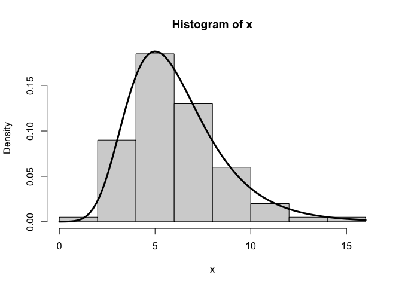

<!-- README.md is generated from README.Rmd. Please edit that file -->

# RTMBdist

<!-- badges: start -->

[](https://lifecycle.r-lib.org/articles/stages.html#experimental)
[](https://github.com/janoleko/RTMBdist/actions/workflows/R-CMD-check.yaml)
<!-- badges: end -->

The [`RTMB`](https://kaskr.r-universe.dev/RTMB) package enables powerful
and flexible statistical modelling with rich random effect structures
using automatic differentiation (AD). However, its built-in support for
probability distributions is limited to standard cases. `RTMBdist` fills
this gap by providing a collection of non-standard, AD-compatible
distributions, extending the range of models that can be implemented and
estimated with `RTMB`. Most of the distributions implemented in
`RTMBdist` allow for automatic simulation and residual calculation by
`RTMB`.

The full list of distributions currently available is given in the [List
of
distributions](https://janoleko.github.io/RTMBdist/articles/distlist.html)
vignette.

Feel free to contribute!

## Installation

You can install the development version of `RTMBdist` from
[GitHub](https://github.com/) with:

``` r
devtools::install_github("janoleko/RTMBdist")
```

## Example

``` r
library(RTMBdist)
```

Let’s do numerical maximum likelihood estimation (MLE) with a `gumbel`
distribution:

``` r
# simulate data
x <- rgumbel(100, location = 5, scale = 2)

# negative log-likelihood function
nll <- function(par) {
  x <- OBS(x) # mark x as the response
  loc <- par[1]; ADREPORT(loc)
  scale <- exp(par[2]); ADREPORT(scale)
  -sum(dgumbel(x, loc, scale, log = TRUE))
}

# automatically differentiable objective function object
obj <- MakeADFun(nll, c(5, log(2)), silent = TRUE)

# model fitting
opt <- nlminb(obj$par, obj$fn, obj$gr)

# model summary
summary(sdreport(obj))
#>        Estimate Std. Error
#> par   5.0015427 0.20659355
#> par   0.6732893 0.07663174
#> loc   5.0015427 0.20659355
#> scale 1.9606760 0.15025002

# plot the estimated density
hist(x, prob = TRUE)
curve(dgumbel(x, opt$par[1], exp(opt$par[2])), add = TRUE, lwd = 3)
```



Through the magic of `RTMB`, we can also immediately simulate new data
from the fitted model and calculate residuals:

``` r
# simulate new data
x_new <- obj$simulate()$x

# calculate residuals
osa <- oneStepPredict(obj, method = "cdf", trace = FALSE)
qqnorm(osa$res); abline(0, 1)
```


